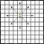
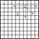
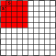

Number puzzle solver
====================

This puzzle solver finds all valid solutions to a simple number puzzle.

## The puzzle

There is a number puzzle (a game, if you will) where you have to enter all the numbers from 1 to 100 in an empty 10x10 grid. The idea is to fill the grid by starting with number 1, then entering number 2, and so on, incrementing the number by one on each step.

There are strict rules on where numbers can be entered. You can start filling the grid (with "1") from any cell in the grid. After this the following number can only be entered in a cell that is three cells away from the last number in the four main directions (up, right, down, left) or two cells away in any diagonal direction. Also, you have to stay within the grid's borders and cannot enter a number in any cell that already has a number.

A progress of one simple puzzle game is demonstrated in the images below. The first picture shows the situation after the first move. The number "1" is inserted near the middle of the grid, and all of the eight possible directions to advance are available.

The second picture shows the situation after the second move. The chosen direction was northeast, so the number "2" was inserted two cells away from the previous cell diagonally. Now only five of the possible directions are available; the three choices going straight or diagonally up are not available because the move would be out of the grid bounds, and going southwest is an invalid move because that cell is already filled.

The third picture shows the situation after eight moves. The game could still be continued to six different directions. The moves that got the game to this state are (after inserting the number "1" in a freely chosen cell): NE, S, S, W, W, N, SE.

## Searching for solutions

I've written a program earlier that finds a single solution to the puzzle by random search. However, this time I wanted to find all possible solutions (so I could later do a graphical presentation of how many solutions there are from each starting point etc.), so a different approach was needed.

The algorithm started as a simple (and stupid) depth-first search, starting separately from each starting point. With very little optimization, the solver ran rather quickly only up to a 5&times;5 grid for which it found all possible solutions in less than a second. For a 6&times;6 grid it found solutions in just under half an hour running on a 2018 MacBook Pro (2.9GHz i9, 32GB of RAM).

### Optimizations

Luckily the puzzle has some interesting characteristics due to the shape of the board and all starting points being equal in the rules.

As the board is a square and the same moving rules apply wherever any starts the game, any valid solution from a particular cell means there are three "identical" solutions in other quadrants of the board also. These can be found simply by rotating the solution on the board 90, 180 and 270 degrees. Actually, if the starting cell isn't on either of the diagonal axes, one can also mirror the solution in relation to the diagonal axis running through the  quadrant the cell is in, and that solution can be rotated to three new solutions also. This means that any solution found proves there are four or even eight solutions to the puzzle. 

It follows from this that one only needs to find solutions from a rather small subset of board cells, and then just mirror and rotate the found solutions to deduce all the solutions the board has. For a 10&times;10 grid, only 15 cells of 100 need to be handled separately, and some of those only partly. These unique starting point cells are shown in the image below. An example starting point for which solutions are found is marked in the image with "S". 

As shown, only about one half of a board quadrant needs to be checked. And when starting from a cell on the diagonal axis of the board, only 5 of the possible 8 first moves – in directions NW, N, NE, E, SE – need to be checked, as the other directions can be handled as mirror images of these. E.g. if the player starts in the cell (2,2) and first moves right (E), and eventually finds a solution, this means that a mirrored solution exists that starts from the same cell and takes a first move down (S).

The algorithm starts deducing these other solutions by first mirroring the ones found diagonally. This is enough to cover one quadrant of the board as starting cells. This is shown in the image below. All solutions starting from the example starting point S are now mirrored as solutions starting from S'.

After all possible solutions for this one quadrant are now known, it's really straightforward to find all solutions for the other quadrants by rotating the solutions 90, 180 and 270 degrees. (The algorithm actually does this by first rotating the original quadrant 90 degrees, then rotating the result of that operation 90 degrees, and once again using the result of that operation and rotating it 90 degrees. But this is just an implementation detail.) The example starting point and its mirror equivalent are shown rotated to each of the other board quadrants.

After this all the existing solutions for the whole board are known.

#### Different sizes of the board

This same logic works for different sizes of the board but there are some small adjustments needed for boards of an odd size, e.g. a 5&times;5 board. The percentage of unique starting cells needed from all board cells is a bit higher as the middle horizontal and vertical axes go through a column and a row of cells, and the cells on those need to be included. The unique starting cells for a 5&times;5 board are shown below.

")

The mirroring logic is exactly the same as it is for an even-sized board.

")

However, rotating the solutions works a bit differently. Only part of the first quadrant is rotated to avoid duplicating solutions.

")

For a 5&times;5 board, only two rows of the 3-row first quadrant are rotated to avoid doubling the solutions in the middle column. These same solutions can be rotated again to the next quadrant to get more solutions. But in the last rotation the solution set must be made smaller again, to a 2&times;2 group of starting cells, to avoid duplication solutions on the middle row. 

#### The effect on the performance

This rather simple optimization makes the search space significantly smaller. As mentioned above, on a full 10&times;10 board, only 15% of the starting cells need to be used to search for solutions, and some of those only partly. This shows also in the running time of the application. A test run with a 6&times;6 board was more than 85% faster using this optimization than the original naive approach.

## License

Copyright © 2014-2022 Mika Viljanen.

Distributed under the Apache License, Version 2.0.
